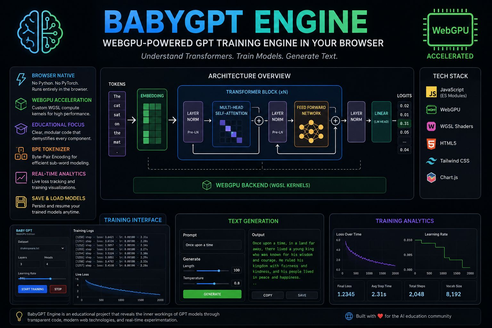

# BabyGPT Engine 🧠⚡

Browser-native GPT training engine powered by WebGPU.

BabyGPT Engine is an educational Transformer implementation written in pure JavaScript that runs directly in the browser without Python, PyTorch or CUDA.

The goal of the project is simple:

> Understand how GPT models work internally by building and training one from scratch.



---

# Features

- WebGPU accelerated tensor operations
- Multi-Head Causal Self-Attention
- Transformer blocks with residual connections
- Layer Normalization (Pre-LN)
- Feed Forward Network (MLP)
- Adam optimizer
- Cross-Entropy loss
- BPE tokenizer
- Autoregressive text generation
- Real-time training dashboard
- Save / load model weights
- Training analytics visualization

---

# Why This Project Exists

Most AI frameworks hide the internals behind massive abstractions.

BabyGPT Engine takes the opposite approach.

The project separates:
- mathematical concepts
- neural network layers
- GPU execution
- tokenizer logic
- training orchestration

This makes the system suitable for:
- AI education
- Transformer experimentation
- browser AI research
- WebGPU learning
- understanding GPT internals

---

# Architecture

```text
BabyGPT Engine
│
├── backend_wgpu.js
│   └── WebGPU compute backend and WGSL kernels
│
├── attention.js
│   └── Multi-Head Causal Self-Attention
│
├── feedforward.js
│   └── Transformer MLP layer
│
├── layernorm.js
│   └── Layer Normalization
│
├── transformer_block.js
│   └── Residual Transformer block
│
├── transformer.js
│   └── Core GPT model and optimizer
│
├── tokenizer.js
│   └── Simple word tokenizer
│
├── BPETokenizer.js
│   └── Byte Pair Encoding tokenizer
│
├── training.js
│   └── Training pipeline
│
├── predict.js
│   └── Autoregressive inference
│
├── benchmark.js
│   └── Tokenizer benchmarks
│
├── index.html
│   └── Main training UI
│
├── stats.html
│   └── Training analytics dashboard
│
└── docs/
    └── theory.md
        └── Mathematical foundations
```

---

# Mathematical Foundations

The engine implements core Transformer equations including:

## Self-Attention

```math
Attention(Q,K,V)=softmax((QK^T)/sqrt(d_k))V
```

## Layer Normalization

```math
x̂=(x-E[x])/sqrt(Var[x]+ϵ)⋅γ+β
```

## Cross Entropy Loss

```math
L=-∑ y_i log(ŷ_i)
```

## Adam Optimizer

```math
θ_t=θ_{t-1}-η(m̂_t/(sqrt(v̂_t)+ϵ))
```

Detailed explanations are available in:

`docs/theory.md`

---

# Requirements

- Chrome 113+ or Edge with WebGPU enabled
- Modern GPU with WebGPU support
- Local HTTP server

---

# Quick Start

## Clone Repository

```bash
git clone https://github.com/YOUR_USERNAME/babygpt-engine.git
cd babygpt-engine
```

## Start Local Server

Using Node.js:

```bash
npx serve .
```

or Python:

```bash
python -m http.server 8000
```

---

# Run The Engine

Open:

```text
http://localhost:3000
```

or

```text
http://localhost:8000
```

depending on your server.

Then:

1. Select dataset
2. Configure model
3. Start training
4. Watch loss decrease in real-time
5. Generate text
6. Save model weights

---

# Training UI

The browser interface includes:

- dataset selection
- layer/head configuration
- learning rate controls
- training logs
- live loss tracking
- text generation
- weight persistence

---

# Analytics Dashboard

Open:

```text
stats.html
```

Features:
- loss curves
- learning rate visualization
- training metadata
- JSON history import

---

# Datasets

Example datasets:

- Shakespeare poems
- philosophy text
- JavaScript code snippets

You can add custom datasets inside:

```text
datasets/
```

---

# Educational Focus

This project intentionally avoids:
- hidden abstractions
- large external ML frameworks
- black-box APIs

The objective is transparency.

Every major Transformer component is visible and modifiable.

---

# Current Limitations

This is an educational engine, not a production LLM framework.

Current limitations include:

- no distributed training
- limited context length
- browser memory constraints
- simplified tensor management
- no mixed precision
- no KV cache optimization
- no gradient checkpointing

---

# Future Ideas

- Flash Attention
- LoRA fine-tuning
- quantization
- multi-GPU browser experiments
- tokenizer training UI
- WebNN backend
- model visualization
- attention heatmaps
- checkpoint manager

---

# Screenshots

Recommended repository assets:

```text
docs/images/
├── training-ui.png
├── stats-dashboard.png
├── architecture.png
└── generation-demo.gif
```

---

# Philosophy

BabyGPT Engine is designed to make Transformer internals understandable.

Not hidden.

Not abstracted away.

Visible.

Runnable.

Hackable.

---

# License

MIT License

---

# Contributing

Pull requests, experiments and educational improvements are welcome.

---

# Project Status

Experimental educational project focused on:
- Transformer learning
- WebGPU experimentation
- browser-native AI systems
- low-level GPT architecture understanding
